### Why RIMBA?

It started with one struggle: **finding reliable information across the organization.**

The motto was we must have RIMBA .... ** Reliable Information on Manufacturing & Business Activities. **

**One place. Reliable information. Better decisions.**


# 🌴 Rimba

## The Digital Foundation for Manufacturing Operations

**Rimba is a modular enterprise platform built for manufacturing companies that want to connect people, processes, assets, documents, services, and organizational knowledge in one digital environment.**

Instead of implementing a collection of disconnected systems, Rimba provides a **common digital foundation** that different business applications can share.

Start with the foundation.
Add only the capabilities you need.
Grow the platform as your business grows.

---

# Why Rimba?

Manufacturing companies rarely have just one system.

They typically have:

* HR systems
* Document management
* Learning systems
* Asset management
* Maintenance systems
* Contract systems
* Service request portals
* ERP
* MES
* Quality systems
* LDAP / Active Directory
* Other specialized applications

The problem is that these systems often operate independently.

People are duplicated.

Organizations are duplicated.

Permissions are duplicated.

Workflows are duplicated.

Documents are stored in different places.

And information about the same person, asset, organization, or process can exist in multiple systems.

### Rimba takes a different approach.

Instead of building every system independently, Rimba provides a **shared enterprise foundation**.

```mermaid
graph TD
    %% Main Platform Hub
    Rimba["RIMBA<br/>Digital Manufacturing Platform"]

    %% Core System Infrastructure Layer
    subgraph Core ["1. Core System & Infrastructure Layer"]
        Asas["Base Package<br/>[rimba/asas]"]
        Bantu["Helpfile Package<br/>[rimba/bantu]"]
        Citra["Branding Package<br/>[rimba/citra]"]
        Jejak["Trail Package<br/>[rimba/jejak]"]
        Sifat["Attributing Package<br/>[rimba/sifat]"]
        Tutur["Translate Package<br/>[rimba/tutur]"]
        Versi["Versioning Package<br/>[rimba/versi]"]
    end

    %% Identity, Auth, & Structure Layer
    subgraph Governance ["2. Identity, Auth & Organization Structure"]
        Siapa["Who Package<br/>[rimba/siapa]"]
        Boleh["Can Package<br/>[rimba/boleh]"]
        Pihak["Organization Package<br/>[rimba/pihak]"]
        Jawat["Position Package<br/>[rimba/jawat]"]
        Orang["People Package<br/>[rimba/orang]"]
    end

    %% Operations, Process & Lifecycle Layer
    subgraph Operations ["3. Operations, Process & Lifecycle"]
        Jalan["Flow Package<br/>[rimba/jalan]"]
        Kerja["Work Package<br/>[rimba/kerja]"]
        Janji["Agreement Package<br/>[rimba/janji]"]
    end

    %% Common Features Layer
    subgraph Common ["3. Common Features"]
        Pelan["Floorplan Package<br/>[rimba/pelan]"]
        Jalur["Menu Package<br/>[rimba/jalur]"]
        Waktu["Time Package<br/>[rimba/waktu]"]
        Laras["Sync Package<br/>[rimba/laras]"]
    end

    %% Business Add-ons Tier
    subgraph AddOns ["4. Business Add-on Extension Tier"]
        Ldap["Ldap Package<br/>[rimba/ldap]"]
        Idp["Idp Package<br/>[rimba/idp]"]
        Dms["Dms Package<br/>[rimba/dms]"]
        Lms["Lms Package<br/>[rimba/lms]"]
        Hrm["Hrm Package<br/>[rimba/hrm]"]
        Tos["Tos Package<br/>[rimba/tos]"]
        Lcs["Lcs Package<br/>[rimba/lcs]"]
        Eam["Eam Package<br/>[rimba/eam]"]
    end

    %% High-level Architecture Flow Connections
    Rimba --> Core
    Rimba --> Governance
    Rimba --> Operations
    Rimba --> Common
    
    %% Architectural Tier Progression
    Core --> AddOns
    Governance --> AddOns
    Operations --> AddOns
    Common --> AddOns

    %% Visual Styling for GitHub Compatibility
    style Rimba fill:#238636,stroke:#333,stroke-width:2px,color:#fff
    style Core fill:#1c1c1e,stroke:#3a3a3c,stroke-width:1px
    style Governance fill:#1c1c1e,stroke:#3a3a3c,stroke-width:1px
    style Operations fill:#1c1c1e,stroke:#3a3a3c,stroke-width:1px
    style Common fill:#1c1c1e,stroke:#3a3a3c,stroke-width:1px
    style AddOns fill:#1f6feb,stroke:#3a3a3c,stroke-width:1px,color:#fff
```





---

# One Digital Foundation for Your Manufacturing Business

Rimba establishes a common digital language across the organization.

Instead of every application creating its own version of:

> Who is this person?
> Which department do they belong to?
> What position do they hold?
> What are they allowed to do?
> Which organization owns this asset?
> Where is this asset located?
> Who is responsible for this work?
> Which workflow should be followed?
> Which document is the approved version?

Rimba provides these capabilities once and makes them available across the platform.

---

# What Does Rimba Give Your Company?

## 👥 Know Your People

Rimba provides a common representation of the people working for your organization.

Employees, contractors, technicians, supervisors, managers and other workers can be connected to:

* Their organization
* Their position
* Their responsibilities
* Their access rights
* Their work
* Their assets
* Their training
* Their requests

This means your business applications can work from the same organizational reality.

---

## 🏢 Understand Your Organization

Manufacturing organizations can be complex.

A company may have:

```text
Group
 └── Company
      ├── Plant
      │    ├── Department
      │    │    ├── Section
      │    │    └── Team
      │    └── Production Area
      │
      └── Corporate Functions
```

Rimba provides the organizational foundation needed to represent this structure.

Applications can then understand **where a person, asset, service, responsibility or decision belongs**.

---

# 🔐 Give People the Right Access

Not everyone should see or change everything.

Rimba provides centralized access control based on:

* Roles
* Permissions
* Responsibilities
* Organizational context
* Policies
* Attributes

This allows organizations to move beyond simple:

> "Admin vs User"

authorization.

Instead:

> **What can this person do, and under what circumstances?**

This is particularly important in manufacturing environments where access may depend on department, position, responsibility, location, process, or data classification.

---

# 🔄 Standardize How Work Gets Done

Manufacturing depends on repeatable processes.

Rimba provides a workflow foundation for turning business processes into controlled digital workflows.

For example:

```text
Request
   ↓
Review
   ↓
Approval
   ↓
Execution
   ↓
Verification
   ↓
Completion
```

Workflows can support:

* Approvals
* Reviews
* Escalations
* Assignments
* State transitions
* Automated actions
* Notifications
* Process tracking

Instead of relying on email, spreadsheets and informal communication, organizations can progressively move their processes into controlled digital workflows.

---

# 🧰 Turn Processes Into Actual Work

A workflow defines **what should happen**.

Rimba also provides the ability to define **the work that must be performed**.

Tasks can be assigned to people or teams with:

* Responsibilities
* Due dates
* Checklists
* Work status
* Completion tracking
* Evidence
* History

This creates a connection between:

**Process → Work → Person → Result**

---

# 🛎️ Create an Internal Service Portal

Manufacturing companies have many teams providing services to other teams.

For example:

### IT

* New laptop
* Software installation
* Network access
* Account request

### HR

* Employment letter
* Training request
* Employee services

### Facilities

* Room booking
* Facility repair
* Access request

### Maintenance

* Equipment service
* Repair request
* Inspection request

Rimba provides the foundation for turning these internal capabilities into a **digital service catalogue**.

Employees can discover a service, submit a request, follow its progress and receive the outcome.

---

# 📍 Connect Work to Physical Locations

Manufacturing is physical.

People work in buildings.

Machines exist in production areas.

Equipment moves between locations.

Maintenance happens at specific places.

Rimba can represent:

```text
Site
 └── Building
      └── Floor
           └── Zone
                └── Room
                     └── Asset
```

This provides a spatial foundation for applications such as:

* Asset Management
* Maintenance
* Facilities
* Emergency Response
* Production
* Workplace Services

---

# 📄 Control Your Business Knowledge

Manufacturing companies depend heavily on controlled information:

* Policies
* Procedures
* Work instructions
* Manuals
* Forms
* Standards
* Quality documents
* Technical documents

Rimba provides the foundation for managing controlled information, including versioning, access and traceability.

With the DMS add-on, this becomes a complete document management capability.

---

# 📝 Know What Changed

Manufacturing organizations need accountability.

Rimba provides a common activity and audit trail across the platform.

You can establish traceability around:

* Who performed an action
* What changed
* When it changed
* Which process was involved
* Which record was affected
* Which workflow decision occurred

This creates a stronger foundation for operational governance, quality management and compliance.

---

# 🔢 Never Lose Track of Versions

Business information changes.

Policies change.

Procedures change.

Documents change.

Configurations change.

Rimba provides a reusable versioning capability so applications can maintain controlled revisions rather than simply overwriting the previous state.

---

# 🤝 Connect Agreements to the Business

Manufacturing companies operate through agreements with:

* Suppliers
* Customers
* Service providers
* Contractors
* Partners
* Employees
* Other organizations

Rimba provides an agreement foundation that can connect agreements to the things they govern.

For example:

```text
Supplier Agreement
       │
       ├── Supplier
       ├── Organization
       ├── Service
       ├── Assets
       └── Related Work
```

The Contract Management add-on extends this into a complete contract lifecycle capability.

---

# 🌐 Connect Rimba to Your Existing Systems

Rimba does not require a manufacturing company to replace everything it already owns.

Instead, it is designed to **coexist and integrate** with existing systems.

Examples include:

* ERP
* MES
* QMS
* Active Directory
* Payroll
* Finance
* Government systems
* External APIs
* Other enterprise applications

Rimba can become the **digital coordination layer** connecting people, processes and business applications.

---

# 🧩 Add Only What Your Business Needs

The biggest advantage of the Rimba architecture is that your company does not need to buy or implement everything at once.

Start with the foundation.

Then add capabilities as your business needs them.

### Start

```text
Rimba Foundation
```

### Add Workforce Management

```text
+ HRM
```

### Add Document Control

```text
+ DMS
```

### Add Learning

```text
+ LMS
```

### Add Internal Services

```text
+ TOS
```

### Add Contract Management

```text
+ LCS
```

### Add Asset Management

```text
+ EAM
```

### Connect Corporate Identity

```text
+ LDAP
+ IDP
```

Your platform grows with your organization.

---

# Rimba Business Capabilities

| Capability       | What It Does for Your Business                             |
| ---------------- | ---------------------------------------------------------- |
| **Foundation**   | Common digital platform for your organization              |
| **People**       | Manage people and their organizational relationships       |
| **Organization** | Model companies, plants, departments, teams and structures |
| **Position**     | Define responsibilities and organizational positions       |
| **Access**       | Control who can access and perform what                    |
| **Workflow**     | Standardize and automate business processes                |
| **Work**         | Turn processes into assigned, trackable work               |
| **Services**     | Provide an internal service catalogue and request portal   |
| **Floorplan**    | Connect operations to physical locations                   |
| **Agreement**    | Connect agreements to organizations, assets and services   |
| **Audit Trail**  | Provide traceability and accountability                    |
| **Versioning**   | Maintain controlled revisions                              |
| **Time**         | Manage shifts, rosters, calendars and time structures      |
| **Integration**  | Connect Rimba with external systems                        |
| **Help**         | Provide contextual user and administrator guidance         |
| **Branding**     | Present the platform using your organization's identity    |

---

# Business Add-ons

## 👨‍💼 HRM — Human Resource Management

Manage your workforce using the same people, organization and position structures already used across Rimba.

**Business value:**

* One consistent employee identity
* Organizational structure
* Position management
* Workforce lifecycle
* Integration with other Rimba applications

---

## 📚 DMS — Document Management System

Turn Rimba into a controlled document environment suitable for quality-driven manufacturing organizations.

**Business value:**

* Controlled documents
* Document revisions
* Approval workflows
* Access control
* Document traceability
* Quality-management support

---

## 🎓 LMS — Learning Management System

Manage organizational learning and competency development.

**Business value:**

* Training programmes
* Courses
* Learning materials
* Assessments
* Training records
* Certificates
* Employee learning history

---

## 🛎️ TOS — Team Offering System

Turn internal departments into digital service providers.

**Business value:**

* Service catalogue
* Online requests
* Standardized forms
* Approval workflows
* Fulfillment tracking
* Better employee experience

---

## ⚖️ LCS — Contract Management System

Extend agreements into a full contract-management environment.

**Business value:**

* Contract lifecycle
* Obligations
* Renewals
* Expiry management
* Contract documents
* Compliance tracking

---

## 🏭 EAM — Enterprise Asset Management

Manage the lifecycle of physical assets across your manufacturing organization.

**Business value:**

* Asset ownership
* Asset assignment
* Asset location
* Maintenance work
* Asset history
* Lifecycle management
* Integration with people, organizations and contracts

---

## 🔑 LDAP — Enterprise Directory Integration

Connect Rimba to your existing Active Directory or LDAP infrastructure.

**Business value:**

* Existing corporate accounts
* Centralized authentication
* Reduced account administration
* Easier enterprise deployment

---

## 🪪 IDP — Single Sign-On

Use Rimba as an Identity Provider for other applications.

**Business value:**

* Single Sign-On
* OAuth2
* Centralized identity
* Application integration
* Reduced authentication complexity

---

# Built for Manufacturing

Rimba is particularly suited to manufacturing organizations because manufacturing is not only about machines and production.

It is about the interaction between:

```text
             PEOPLE
                │
                ▼
          ORGANIZATION
                │
                ▼
            PROCESS
                │
                ▼
              WORK
                │
       ┌────────┼────────┐
       ▼        ▼        ▼
     ASSETS   DOCUMENTS  SERVICES
       │        │        │
       └────────┼────────┘
                ▼
            LOCATION
                │
                ▼
             RESULT
```

Rimba provides the common digital foundation connecting these elements.

---

# From Fragmented Systems to One Digital Platform

### Traditional Environment

```text
HR ─────────── Employee Data

DMS ────────── Document Data

EAM ────────── Asset Data

LMS ────────── Training Data

Service Desk ─ Request Data

ERP ────────── Business Data
```

Each system develops its own:

* Users
* Roles
* Organizations
* Workflows
* Data relationships
* Audit mechanisms

### Rimba Approach

```text
                    RIMBA
                      │
       ┌──────────────┼──────────────┐
       │              │              │
     PEOPLE      ORGANIZATION      ACCESS
       │              │              │
       ├──────────────┼──────────────┤
       │              │              │
    WORKFLOW         WORK          AUDIT
       │              │              │
       └──────────────┼──────────────┘
                      │
       ┌──────────────┼──────────────┐
       ▼              ▼              ▼
      HRM            DMS            EAM
       │              │              │
       ▼              ▼              ▼
      LMS            TOS            LCS
```

The systems still perform their specialized functions.

But they operate on a **shared foundation**.

---

# The Rimba Advantage

### One Foundation

Build your applications on a common platform rather than starting from zero every time.

### One Organizational Context

People, positions, departments and organizations can be shared across applications.

### One Access Model

Centralize authorization instead of maintaining independent permission models.

### One Workflow Foundation

Use a common process engine across different business functions.

### One Audit Trail

Create consistent traceability across the platform.

### One Integration Layer

Connect Rimba with existing enterprise systems.

### Modular Growth

Deploy what you need today and add capabilities tomorrow.

### Manufacturing Focus

Designed around the realities of organizations where people, processes, assets, documents and physical locations must work together.

---

# Rimba Is More Than Another Business Application

Rimba is intended to become the **digital operating foundation of the manufacturing organization**.

Rather than asking:

> "Which application should we buy for this particular problem?"

Rimba enables a different question:

> **"How can we build this capability on our common enterprise platform?"**

That means new applications and processes can reuse the organization's existing:

* People
* Organizations
* Positions
* Access rules
* Workflows
* Work
* Documents
* Locations
* Agreements
* Audit trail
* Integrations

---

# Start Small. Grow Without Starting Again.

Rimba does not require a manufacturing company to transform everything at once.

Start with one business problem.

Then expand.

```text
                    START
                      │
                      ▼
              RIMBA FOUNDATION
                      │
          ┌───────────┼───────────┐
          ▼           ▼           ▼
         HRM         DMS         TOS
          │           │           │
          └───────────┼───────────┘
                      ▼
                     LMS
                      │
                      ▼
                     EAM
                      │
                      ▼
                     LCS
                      │
                      ▼
              Enterprise Platform
```

Every new capability builds on the same foundation.

**No need to rebuild your digital foundation every time you add another system.**

---

# 🌴 Rimba

### One Foundation. Many Capabilities. One Connected Enterprise.

**Rimba gives manufacturing companies a common digital foundation for connecting their people, organization, processes, work, assets, documents, services and business applications.**

Start with what matters today.

Build what you need tomorrow.

**Grow your digital enterprise without rebuilding it from the ground up.**
